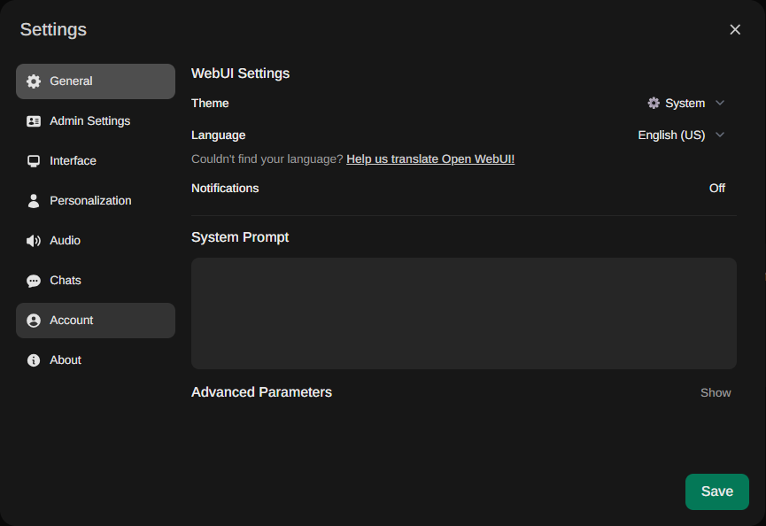
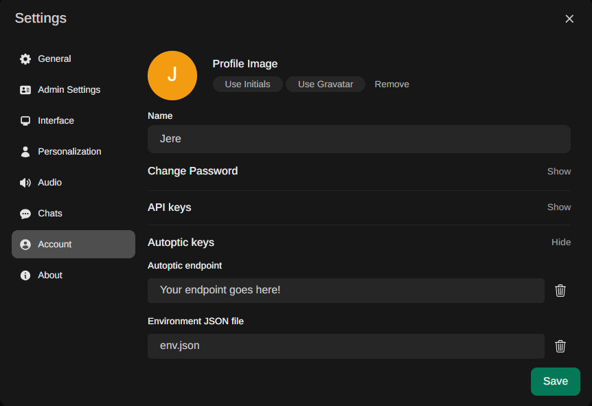
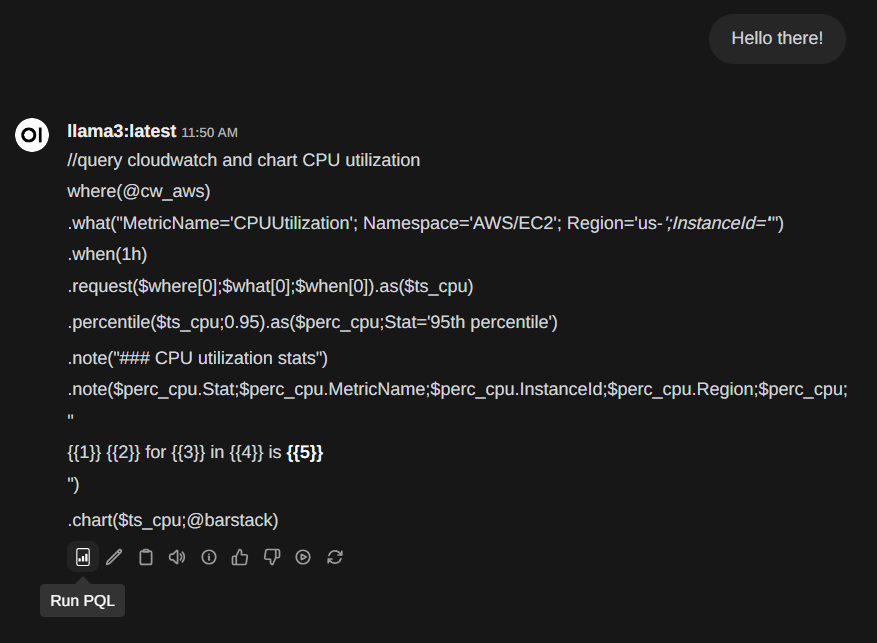
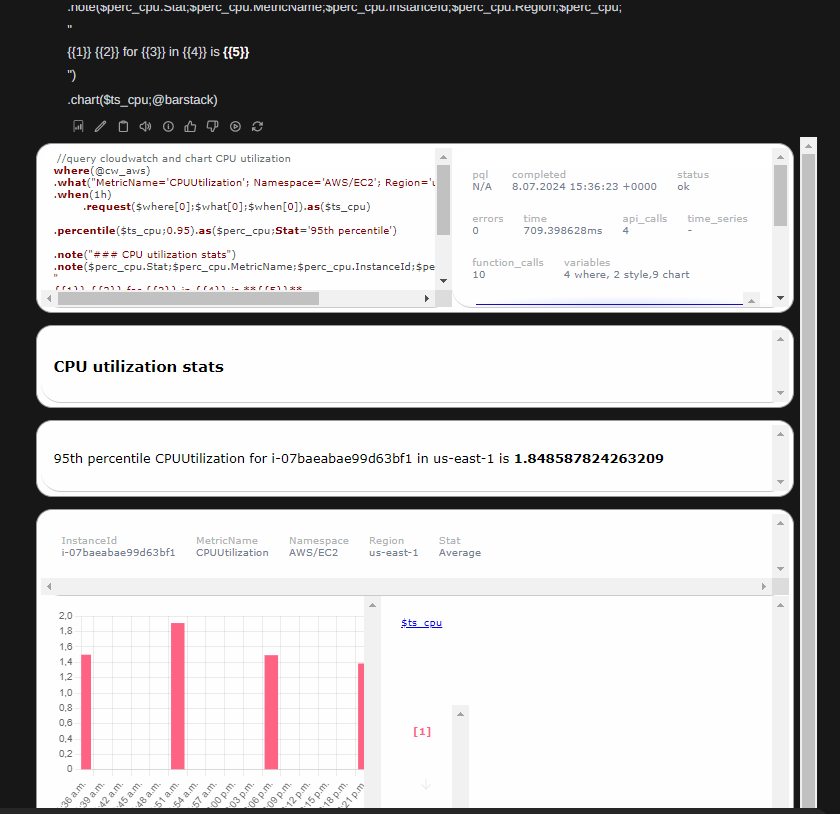

# Run your PQL Queries! 🚀

## Prepare your credentials

[Signup and activate to get an Autoptic endpoint.](https://www.autoptic.io/#signup) and get your "aws_access_key_id" and "aws_secret_access_key" credentials. The account must have read access to CloudWatch. For more information check the AWS guide on access credentials. Autoptic does not cache or store the credentials you submit over the API.

Note: It will be necessary to be able to download the `env.json` so that you can add the credentials.

## Configure your credentials

Now that you have your credentials, you must add your Autoptic API endpoint and a JSON property file with your AWS credentials ("aws_access_key_id" and "aws_secret_access_key"). In the user settings, go to the account configuration and then show the "Autoptic keys" section.

You must add your Autoptic API endpoint and a JSON property file (this file can be named as you want). Remember to save your configuration before close the window! 

Once you did this, you are ready to use the new feature to run your PQL Queries.

## Prepare your query message

For now, you must edit the chat message with your PQL Query and press the 'Run PQL' button under the message. Wait a little and then the charts and graphics of your metrics will be loaded in the chat! 

Eventually, you can ask the chat for a specefic query and run the API without editing.

This will not banish if you refresh or close the browser. However, if you switch between chats, the first time you change the chat they will load incorrectly. This will be fixed in the next version.
